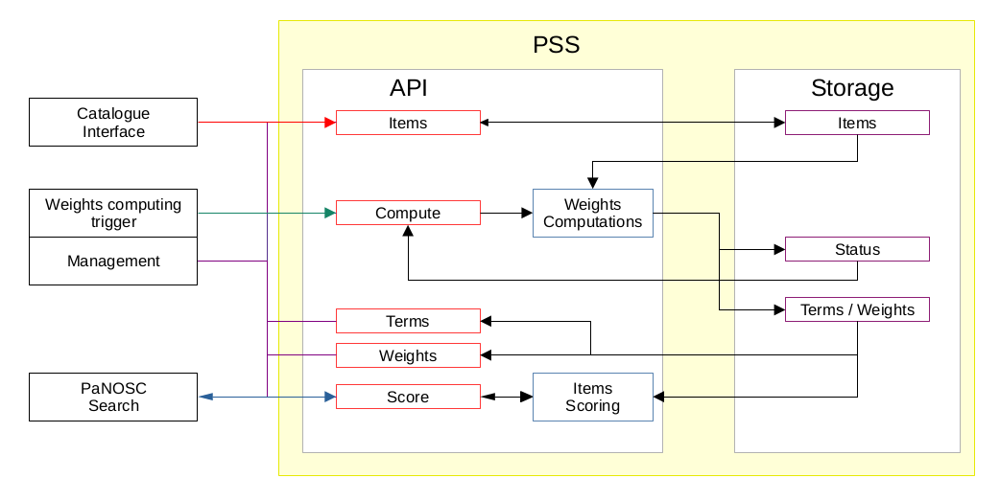

# PaNOSC Federated Search Results Scoring
## Background Information
Compiled and reviewed by ESS team  
*\(Max Novelli, Henrik Joansson , Fredrik Bolmsten, Tobias Richter\)*  
*v 2022\-01\-13*

## Table of Contents
- [Introduction](\#\_\_RefHeading\_\_\_Toc1604\_772818505)
- [Scoring overview](\#\_\_RefHeading\_\_\_Toc2474\_772818505)
- [Scoring implementation](\#\_\_RefHeading\_\_\_Toc2476\_772818505)
    - [Weights computation](\#\_\_RefHeading\_\_\_Toc2478\_772818505)
        - [Term Frequency \(TF\)](\#\_\_RefHeading\_\_\_Toc2480\_772818505)
        - [Inverse Document Frequency \(IDF\)](\#\_\_RefHeading\_\_\_Toc2482\_772818505)
        - [Term frequency – Inverse Document Frequency \(TF\-IDF\)](\#\_\_RefHeading\_\_\_Toc2484\_772818505)
    - [Score computation](\#\_\_RefHeading\_\_\_Toc2486\_772818505)
    - [Score meaning and value](\#\_\_RefHeading\_\_\_Toc1165\_2611254846)
    - [Federated items selection](\#\_\_RefHeading\_\_\_Toc2488\_772818505)
    - [FAQ](\#\_\_RefHeading\_\_\_Toc2490\_772818505)
- [Example Implementation](\#\_\_RefHeading\_\_\_Toc2498\_772818505)
    - [Architecture](\#\_\_RefHeading\_\_\_Toc2500\_772818505)
    - [Workflow](\#\_\_RefHeading\_\_\_Toc2535\_772818505)
    - [Scoring service](\#\_\_RefHeading\_\_\_Toc2585\_772818505)
- [On\-going updates and improvements](\#\_\_RefHeading\_\_\_Toc1581\_2289637335)
    - [Remove pandas dataframe dependencies](\#\_\_RefHeading\_\_\_Toc1583\_2289637335)
    - [Implement incremental weights update](\#\_\_RefHeading\_\_\_Toc1585\_2289637335)
- [Future development](\#\_\_RefHeading\_\_\_Toc2587\_772818505)
    - [Biases](\#\_\_RefHeading\_\_\_Toc2589\_772818505)
    - [Multiple weights computation methods](\#\_\_RefHeading\_\_\_Toc2591\_772818505)
    - [Facility weights re\-calibration](\#\_\_RefHeading\_\_\_Toc2593\_772818505)
    - [Facility scoring re\-calibration](\#\_\_RefHeading\_\_\_Toc2595\_772818505)
    - [Federated scoring re\-calibration](\#\_\_RefHeading\_\_\_Toc2597\_772818505)
- [Resources](\#\_\_RefHeading\_\_\_Toc1587\_2289637335)

Introduction
============

This document illustrates the work that ESS has been doing on scoring the results returned by the federated search, work done under the PaNOSC WP3. The solution selected, and implemented at ESS, has each facility scoring their set of results independently based on their body of documents and the query provided. The results are than send to the federated search and merged before being sent to the user. The objectives of the method implemented are to perform a scoring which is fair, effective and unbiased although some elements are performed independently on disjoint subsets of the whole set of the documents the search is performed on. 

In this document, _PaNOSC federated search results scoring_ is also referred to as _PaNOSC Search Scoring_ and _scoring system_ for short.

Scoring overview
================

A search on internet quickly highlights that our problem of selecting the best results matching the query provided is related to “document relevance” in information retrieval \( [Relevance in information retrieval on wikipedia](https://en.wikipedia.org/wiki/Relevance\_\(information\_retrieval\)) and [Determining relevance, how similarity is scored](https://moz.com/blog/determining\-relevance\-how\-similarity\-is\-scored) \) . 

With further research, we found that such relevance can be implemented using a method called _term frequency – inverse document frequency_, TF\-IDF for short \( [TF-IDF on wikipedia](https://en.wikipedia.org/wiki/Tf\-idf) \), which elastic search is also based upon \( [How scoring works in elasticsearch](https://www.compose.com/articles/how\-scoring\-works\-in\-elasticsearch/) \). 

TF\-IDF assigns a unique weight to each pair \(*term*,*document*\) where term is a properly pre\-processed word extracted from the document itself and document is an item in our corpus \(aka set of documents, [corpus on wikipedia](https://en.wikipedia.org/wiki/Text\_corpus) \). The weight is zero if the term is not present in the document, therefore is not relevant. On the contrary, the weight is one if the term has the highest relevancy in the document.

Unfortunately, to compute the IDF portion of the weights, TF\-IDF method requires access to all the documents in the corpus. PaNOSC federated search relies on each facility to store their set of documents shared, compute and provide properly scored search results. As a consequence, PaNOSC federated search does not have access to the full set of documents \(as in items to be scored\), so this method cannot be used unless the infrastructure is re\-designed and re\-implemented, which is outside of this project.  
A solution to this issue was found in the publication [“TF\-IDuF: A Novel Term\-Weighting Scheme for User Modeling based on Users' Personal Document Collections” \(Beel, Joeran & Langer, Stefan & Gipp, Bela. 2017\)](https://www.researchgate.net/profile/Joeran-Beel/publication/313065316_TF-IDuF_A_Novel_Term-Weighting_Scheme_for_User_Modeling_based_on_Users%27_Personal_Document_Collections/links/588f5ad7a6fdcc2351be729d/TF-IDuF-A-Novel-Term-Weighting-Scheme-for-User-Modeling-based-on-Users-Personal-Document-Collections.pdf). The relevant finding in this paper is that the scoring results performed with TF\-IDF are minimally impacted if you perform the scoring independently on disjointed subsets of the complete set of documents. If the disjoint set of documents is defined as the set of documents that each facility has available in their catalogue and it is not accessible by other facility, we can apply the process highlighted in the paper, compute the scores locally and compare them globally. Therefore, we decided to adopt the **_TF\-IDuF_** method. We compute the scores independently at each individual facility utilizing the TF\-IDF weights computed locally, as indicated to the paper above. These results are than merged at the federated level and sorted accordingly to the computed scores.

Scoring implementation
======================

The scoring process requires access to the complete body of documents that needs to be scored. According to the TF\_IDuF paper and the constraint just mentioned, each facility is required to run the scoring process in\-house. Although this configuration increase demands on management and processing power, it allows to reduce accessing time to the facility’s catalogue and a tighter integration for better performances.

The scoring process happens in two phases: _weight computation_ and _score computation_.

Before providing an overview of the scoring system and process, we need to define few concepts: scoring information, relevant fields, meaningful terms, items and corpus. 

* **_Scoring information_** is all the text for each entry that is used for the weights computation and the query scores computation.
* **_Relevant fields_** is the set of selected fields present in the catalogue that is used to extract the scoring information for each entry of the catalogue. It is a subset of the information present in the catalogue system and a superset of the fields provided through PaNOSC search.
* **_Meaningful terms_**, also simply _terms_, are the words extracted from scoring information and preprocessed as explained later in this document. 
* An **_item_** is an entry of the catalogue that needs to be scored. So far, we have been referring to the as Documents as they are called in Natural Language Processing. Unfortunately, we have different type of documents that needs to be scored, which in PaNOSC language are datasets and documents. To avoid confusion, we decided to call them items. In the future additional type might be included. 
* The **_corpus_** is the whole set of items that we are performing the score on. 
* **_Results sets_** is the set of items returned by the service as a results of a search or query.


Weights computation. 
---------------------

This is the most resource intensive step. It can be performed off\-line at reasonable intervals. It is important to run the weight computation after updating or adding new items in the corpus. The decision when the weights computation should be run is left to the individual facility. The only requirement is that new entries added in the facility catalogue are available and scored through the Panosc federated search, relatively soon after. Each facility should understand that a delay in running the weight computation results in a delay of the new entries availability in Panosc federated search results.

Each facility needs to select the relevant fields and, therefore, specify the scoring information to be used in the scoring. The minimal viable set of relevant fields is the one containing exactly the fields provided to the federated search. This is an acceptable solution, although it might leave out relevant information that help items score higher in relevancy for specific queries. An important consideration is that storage usage required with the scoring information selected. If the whole item is selected as scoring information, each catalogue entry is loaded as a whole in the scoring system, and the space requirements are in fact doubled as the information of each item is duplicated from the catalogue to the scoring system.

Once each facility has deployed the scoring system, it must populate it with the scoring information for each shared item. Each item are preprocessed to extract meaningful terms. One weight is computed for each pair \(term, item\). Its value is obtained according to the TF\-IDF method. These weights are intended to reflect how relevant the associated term is to the item within the corpus. The output of this step is a sparse matrix with as many columns as many unique terms have been extracted from the whole set of items and as many rows as many items have been inserted in the scoring system. The weight matrix must be saved within the scoring system, possibly, in a dedicate database as part of the weight computation process. 

  
The current ESS implementation of the scoring system and all its subsystems has been done in Python which, in this point in time, offers the best set of libraries for natural language processing \(NLP for short\). NLP libraries are used to extract meaningful terms from each item’s scoring information populated in the scoring system. We refer to this process as _item preprocessing_, or _terms extraction_ or, simply, _extraction_.

The extraction workflow implements the following series of steps in the exact order on each item:

1. retrieve item’s scoring information
2. stringify scoring information
3. convert text to lower case
4. remove punctuation \(pass 1\)
5. remove stop words \(pass 1\)
6. remove apostrophes
7. remove extra spaces
8. remove stop words \(pass 2\)
9. extract words from each item
10. applying stemming to all words and create terms
11. remove punctuation \(pass 2\)
12. remove spaces \(pass 2\)
13. remove short terms \(length 1\)
14. computes TF for each term of each items
15. computes IDF for each term
16. computes TF\-IDF for each \(term, item\) pair


Stemming is the process of reducing inflected words to a root word. Usually the the root word that we call term, resemble the original word, but it is not a real word.

More information regarding stemming can be found on the [wikipedia page realted to stemming](https://en.wikipedia.org/wiki/Stemming). 

There are other options to reduce words to terms, like lemmatization. We have selected stemming as it is a more performant process and does not have any additional dependencies. Once we have successfully deployed the first version of the scoring system, it is our intention to do further research on the subject by exploring and evaluating other reducing options within the scope of NLP .


The literature offers many different variations on how to compute a TF\-IDF weight. In the first implementation of our scoring system, we have implemented the TF\-IDF as follow.


### Term Frequency \(TF\)

${\displaystyle TF(t,I) = \frac{Nt(t,I)}{Nt(I)} }$

Where: 

* $TF(t,I)$ is the term frequency for the term _t_ within the scoring information of the item _I_ of the facility corpus.
* $Nt(t,I)$ is the number of appearances of the term _t_ within the scoring information of the item _I_ of the facility corpus.
* $Nt(I)$ is the total number of terms in the scoring information of the item _I_ of the facility corpus.


### Inverse Document Frequency \(IDF\)

${\displaystyle IDF(t) = log_{10}(1 + \frac{T_C}{T(t)})}$

Where: 

* $IDF(t,I)$ is the inverse document frequency for the term _t_ within the scoring information of the item _I_ of the facility corpus.
* $T_c$ is the total number of items in the facility corpus.
* $T(t)$ is the number of items of the facility corpus which contains at least one instance of the term _t_ in the scoring information.


### Term frequency – Inverse Document Frequency \(TF\-IDF\)

${\displaystyle TF-IDF(t,I) = TF(t,I)*IDF(t) }$

Where: 

* $TF-IDF(t,I)$ is weight computed as term frequency inverse document frequency. In our case, it is actually $TF-IDF(t,I)$ where _u_ indicates that the weight is computed on disjoined subsets of the complete corpus of available items. Each disjoint subset is the corpus of items available and accessible in each facility catalogue.
* $TF(t,I)$ is the term frequency for the term _t_ in the scoring information of the item _I_.
* $IDF(t)$ is the inverse document frequency for the term t


As stated before, the output of this step is a sparse matrix where each \(term,item\) pair has an associated TF\-IDF score computed over the corpus of items present within the facility. The matrix has dimensions _tn_ by _dn_ where _tn_ is the number of unique terms extracted from the scoring information from all the items in the facility’s corpus and _dn_ is the number of items present in the facility’s corpus. The weight matrix can be quite large, although using few optimizations, such as storing only non\-zero elements, we can reduce the storage needed considerably. The scoring system should manage all the operations needed to store and retrieve the weight matrix, so the process is completely transparent to the user. 


Score computation
-----------------

Users submit a query _qu_ and the number of items requested _nu_ to the federated search, which in turn, it submits the query as\-is to each facility search api. Each api has to retrieve the results set from their catalogue, and then submit it together with the query to the scoring system.

The scoring system will perform term extraction on the query, extracting meaningful terms needed for the scoring. The weights matrix is reduced by selecting only the rows related to the items present in the results set and the columns matching the query’s meaningful terms. Missing values are set to 0 by default. 

This action is equivalent to project each item in the query space which has lower dimensionality compared to the whole terms space. It is an optimization aimed to reduce the compute time which results in faster scoring and has minimal impact on the scoring results.

Once the weights are retrieved, each item in the results set is scored computing the _cosine similarity_ \( [Cosine similarity on wikipedia](https://en.wikipedia.org/wiki/Cosine\_similarity) and [SciKit Learn](https://scikit\-learn.org/stable/modules/generated/sklearn.metrics.pairwise.cosine\_similarity.html) \) between the vector representation of the item and the unit vector representing the query terms in the query space. The score computed is the _relevancy index_ of the item in the query space

The items in the results set are matched with their relevancy score, sorted according to the score, the first _nu_ are sent back to the federated search, where _nu_ is the number of items requested by the user. If the user does not provide number of items requested _nu_, the system impose by default a limit _nd_ which can be set in the configuration.

Score meaning and value
-----------------------

The score computed provide a measure of how relevant the item is for the query _qu_ submitted by the user. As mentioned in the previous paragraph it can be called _relevancy index_, but also _relevancy score_.

The relevancy score is lower bound to 0 and upper bound to 1. Such limits are imposed by the cosine similarity method used in the computation, and it is a useful property for comparing numbers that are computed in a distribute system. 

A value of 0 means that the item is not relevant at all for the query _qu_, while a value of 1 means that the item is completely relevant for the query _qu_. The value of 1 means an exact match and has a really low probability to be obtained.

Federated items selection 
--------------------------

The federated search API collects the _nf\(i\)_ results from each facility _I._ Results _nf\(i\)_ returned by facility _i_ is less than or equal to the number of results requested by the user _n_u. These results will be provided with an associated score computed according the TF\-IDuF methodology. The relevancy score will have a value between 0 and 1, as explained in the previous paragraph.  
All the results will be all combined together and sorted in descending order according to the relevancy score. The first _nu_ results are selected as the most relevant items according the query received, and sent back to the user as query results. _nu_ is the number of items requested by the user.


FAQ
---

* _How many query items should be required to each facility if the user requires n items?_

When the user requests _n_ entries from the federated search, an equal number of entries needs to be obtained from each facility. This is a rule\-of\-thumb that has been established empirically by ESS in a test environment simulating the real setup. Requesting results sets of _n_ items from each facility to provide _n_ items to the users allows to minimize the variability of the items selected without ballooning the number of items requested from each facility, therefore reducing network traffic to a minimum. 

To further illustrate the concept: if the user requests 10 datasets matching the query “magnetic and water”, the federated search will request 10 datasets matching the same query from each facility, receiving results set with up to 10 items from each one of them.


* _How can each facility return the most relevant items in the context of the query?_

Upon receiving a user query, the first step for each facility is to obtain a results set from its own catalogue system matching the query and any additional selector. The number of items in the results set is most likely different from the number of items requested by the federated search and, therefore, by the user. In many cases, the catalogue system returns a results set containing a number of items which is far greater than the one requested. As a consequence, we need to reduce the dimensions of such results set before send it back to the federated search. 

In order to select which items to return and do so intelligently, the items have to be selected based on relevancy to the query provided. We decided to perform the selection by scoring each item using cosine similarity between the vector representation of the item in the query space and the query itself. The vector representation is assembled using TF\-IDF weights associated to each terms extracted from the item itself. 

The final score of each item is a number between 0 and 1, where 0 means that the item is not relevant at all, while the value of 1 means that the item has 100% relevance to the user query. The items selected to be sent back to the federated search are the first _n_ elements of the results set, after the set has been ordered in descending order according to the relevancy score computed and assigned in the context of the query.


* _How can the federated search merge the set of results provided by each facility so that the most relevant items are selected across all the facilities?_

We assume that each item in the results set returned by every facility are paired with their relevancy score. Also based on the method that we use to compute such scores, we can assume that they are fair, balanced and minimally biased even if computed independently. As previously explained, all the scores have value between 0 and 1, which allow us to compare each individual score independently from the source facility. With the previous conditions in place, the federated search can simply merge the _n_ items received in the results sets of each facility, create a single list of all the results collected which contains at least n items, order them in descending order according to the relevancy score, select and return only the first _n_, as requested by the user.  


Example Implementation
======================

ESS will provide an example implementation of the scoring system, as it is deployed at ESS, which is built with the methodology previously explained. Ultimately each facility will be responsible to maintain their instance of the scoring infrastructure and PaNOSC search API.


Architecture
------------

The diagram in Fig.1 illustrates the overall schema of the whole infrastructure needed to produce PaNOSC federated search with scores. It includes the components required both at the facility level and at the federated level, as indicated in the figure.

  
_Figure 1. PaNOSC Federated Search Infrastructure_

As it is highlighted in the schema in fig. 1, the user interacts with the PaNOSC federated search api, which is currently exposed at [ _https://federated.scicat.ess.eu_](https://federated.scicat.ess.eu/). The full URL to access the api is [ _https://federated.scicat.ess.eu/api_](https://federated.scicat.ess.eu/api), while the swagger explorer interface can be found at [ _https://federated.scicat.ess.eu/explorer_](https://federated.scicat.ess.eu/explorer). The code for the federated search can be found in the repository [https://github.com/panosc\-eu/panosc\-federated\-search\-service.git](https://github.com/panosc\-eu/panosc\-federated\-search\-service.git) under the master branch. The current released version is v2.2, which is also running at the official production deployment as it can be verified in the status information returned at the URL [https://federated.scicat.ess.eu](https://federated.scicat.ess.eu/) _._ Following are the information retrievable through the main URL:

```
    {
     "uptime_seconds"       : 934956.971,
     "uptime"               : "259:42:36",
     "api_version"          : "v2.2",
     "docker_image_version" : "v2.2",
     "hosting_facility"     : "ESS",
     "environment"          : "production",
     "data\_providers"      : [
       "https://icatplus.esrf.fr/api",
       "https://scicat.ess.eu/panosc-api",
       "https://fairdata.ill.fr/fairdata/api"
     ]
    }
```

A docker image with the latest release of the service is also available on docker hub at the following docker repository URL: [https://hub.docker.com/repository/docker/nitrosx71/panosc\-federated\-search](https://hub.docker.com/repository/docker/nitrosx71/panosc\-federated\-search).


Workflow
--------

The user submits her query _q_ together with the number of items requested _nu_ that she would like to receive \(requested items\) to the PaNOSC federated search api. The query _q_ and the number of items requested _nu_ are sent and submitted as\-is to the PaNOSC search API implemented by each participating facility. 

Each facility extracts the relevant results from their catalog based on the query _q_ provided and according to what has been previously established in WP3. The results are scored using the weights computed off\-line according to the method and tools provided under WP3 which have been previously introduced and explained. Once the scores are assigned, each facility will send the first _nu_ scored results back to the federated search layer. The federated search merges together all the results from all the participating facilities according to the assigned scores and returns only the most relevant _nu_ to the user.

Scoring service
---------------

Figure 2 provides a detailed overview of how the ESS Search Scoring system is implemented and the endpoints groups available through the API. 


_Figure 2. ESS Search Scoring System_

The ESS implementation of the PaNOSC Search Scoring is available as open source project at the repository [https://github.com/panosc\-eu/panosc\-search\-scoring](https://github.com/panosc\-eu/panosc\-search\-scoring) under the master branch. Current version is v1.0\-beta\-3. A docker image tagged accordingly is available on docker hub in the repository [https://hub.docker.com/repository/docker/nitrosx71/panosc\-search\-scoring](https://hub.docker.com/repository/docker/nitrosx71/panosc\-search\-scoring). 

If a facility decide to deploy ESS implementation of the scoring, they can do so by leveraging the docker\-compose available in the official repository which deploys the latest release of the service together with a mongodb which is used as permanent storage for scoring information, and scoring weights.   
Once the ESS implementation of the scoring is deployed, the facility is responsible for the following three steps:

1. Populating the scoring information
2. Trigger the weight computing
3. Configure the PaNOSC search api to integrate with the scoring


Populating the scoring information can be achieved writing an ad\-hoc integration service and deploy it on the facility IT infrastructure. This service periodically updates the scoring information in the scoring service from the relevant fields from the catalogue system. Such service can be based on the jupyter notebook provided as an example under the notebook folder of the code repository.

Triggering the weight computation is achieved by a POST request to the dedicated endpoint of the scoring service. Each facility has to decide if the computation should happens periodically or on demand and make sure to configure their IT infrastructure accordingly

If SciCat is the catalogue of choice, the PaNOSC search api implementation for SciCat already provides the scoring integration. Please refer to the PaNOSC search api documentation for the integration steps.

Integration with and management of the scoring service is done through the API, which is highlighted in the document PaNOSC Federated Search results scoring api circulated together with this document. They can also be found in the docs folder of the code repository.


On\-going updates and improvements
==================================

Remove pandas dataframe dependencies
------------------------------------

The first implementation of PaNOSC Search Scoring was implemented using Pandas Dataframes to facilitate testing and result validation. Unfortunately Pandas Dataframes introduce a overhead which impact the performances when running background tasks in an automated environment. Dataframes also do not handle efficiently sparse matrices, which results in an excessive use of memory.  
Numpy matrices were a natural candidates, although they implement only dense matrices. Scipy sparse matrices are the optimal candidate to improve performance and optimize memory use.  
At the time of this review, PR \#4 has been just merged to replace all pandas dataframe with scipy sparse matrices.

Implement incremental weights update
------------------------------------

An important feedback triggered by the workshop has been to implement incremental weights computation, opposite to a full weights updates that needs to be triggered separately.  
The aim of this improvement is to update the relevant weights when one item or a group of items are updated or added to the system.  
A research on the web for incremental TF\-IDF computation has produce few results which highlighted a possible implementable solution.  
We are currently testing the feasibility of the solution found and we envision that it will included in the next release.

Future development
==================

In this section, we highlight possible future development of the scoring system and the PaNOSC federated search.

Biases
------

Most likely, the federated search results will contain biases. Unfortunately, type and entity of such biases are not currently known. It is our intention to monitor and collect data on scored results set provided by the PaNOSC federated search, and assess such biases. Results will guide us in deciding if corrective actions will be needed and how to include them in future versions of the scoring system. The corrective actions will be possibly implemented both at the facility and federated level.


Multiple weights computation methods
------------------------------------

Future research to improve computation methods might allow us to discover better suited, and more performant methods for weight computing. We might decide that there is a value in implementing all or some of them and reduce multiple \(item,term\) pair weights vectors in a single weight to populated the weight matrix used in scoring. This component will have to be developed and included in the weight computation at the facility level, although clear implementation and design directive will be provided.


Facility weights re\-calibration
--------------------------------

The analysis of individual facilities weight matrices, scores and results sets might uncover localized biases that might need to be address. If corrective actions for the \(item,term\) pair weight are required, the facility will be asked to include additional modules in its infrastructure to implement such actions. 

Facility scoring re\-calibration
--------------------------------

Upon analysis of results sets and biases, we might decide to implement a correcting factor for facility scores. Again, such corrective action has to be implemented at the facility level.


Federated scoring re\-calibration
---------------------------------

Within the federated search implementation, we envision that might be beneficial to insert a scoring re\-calibration block to address system wide biases that require a comparison of results between facilities. 

A use case could be that we might want to enforce the requirement that each result set sent to the user has to contain at least one item from each facility. This requirement will be implemented in a re\-calibration service performed within the federated search, and it will be completely transparent to the user. 


Resources
=========

* [Relevance in information retrieval](https://en.wikipedia.org/wiki/Relevance\_\(information\_retrieval\))
* [Determining relevance, how similarity is scored](https://moz.com/blog/determining\-relevance\-how\-similarity\-is\-scored)
* [TF-IDF](https://en.wikipedia.org/wiki/Tf\-idf)
* [How scoring works in elasticsearch](https://www.compose.com/articles/how\-scoring\-works\-in\-elasticsearch)
* [Text corpus](https://en.wikipedia.org/wiki/Text\_corpus)
* [TF\-IDuF: A Novel Term\-Weighting Scheme for User Modeling based on Users' Personal Document Collections \(Beel, Joeran & Langer, Stefan & Gipp, Bela. 2017\)](https://www.researchgate.net/profile/Joeran-Beel/publication/313065316_TF-IDuF_A_Novel_Term-Weighting_Scheme_for_User_Modeling_based_on_Users%27_Personal_Document_Collections/links/588f5ad7a6fdcc2351be729d/TF-IDuF-A-Novel-Term-Weighting-Scheme-for-User-Modeling-based-on-Users-Personal-Document-Collections.pdf)
* [Stemming](https://en.wikipedia.org/wiki/Stemming)
* [Cosine similarity, wikipedia](https://en.wikipedia.org/wiki/Cosine\_similarity)
* [Cosine similarity, SciKit Learn](https://scikit\-learn.org/stable/modules/generated/sklearn.metrics.pairwise.cosine\_similarity.html)
* [PaNOSC federated search, status page](https://federated.scicat.ess.eu)
* [PaNOSC federated search, API](https://federated.scicat.ess.eu/api)
* [PaNOSC federated search, explorer interface](https://federated.scicat.ess.eu/explorer)
* [PaNOSC search scoring, git repository](https://github.com/panosc\-eu/panosc\-federated\-search\-service.git)
* [PaNOSC search scoring, docker image repository](https://hub.docker.com/repository/docker/nitrosx71/panosc\-federated\-search)
* [Incremental Sparse TFIDF & Incremental Similarity with Bipartite Graphs](https://www.researchgate.net/publication/329305471\_Incremental\_Sparse\_TFIDF\_Incremental\_Similarity\_with\_Bipartite\_Graphs)
* [Real Time Event Detection Adopting Incremental TF-IDF
based LSH and Event Summary Generation](https://www.ijcaonline.org/archives/volume180/number13/kannan\-2018\-ijca\-916252.pdf)

